# How I Hacked Uber’s Hidden API to Download 4379 Rides

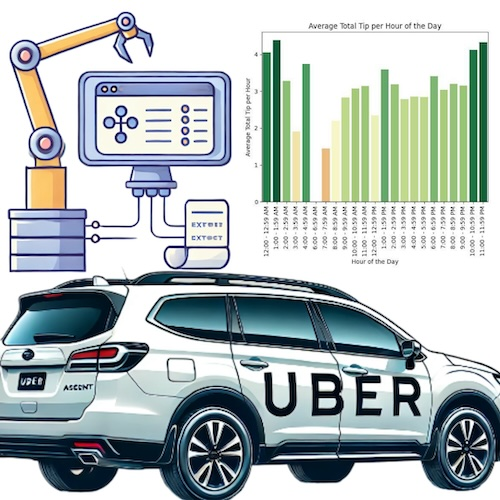

When companies build walls around your own data, you have two choices: wait and hope, or take control.

I chose control.

In this post, I’ll show you how I reverse-engineered Uber’s internal APIs to scrape my driver earnings data programmatically with zero API key, how I cleaned it up to be useful for downstream data analysis, and then how I was able to derive actionable insights from that data.


Between January 9 2023 and September 30 2024 I drove with Uber sometimes 7 days a week for a total of 4379 passenger rides. I had over 2500 rides with 5 star ratings and I averaged 4.98 stars. Being an analytical person I wanted to learn from my experience. With such a data-driven app, I thought surely there’d be a way to get my data about my driving. 

However, when I looked at the [Drivers API](https://developer.uber.com/docs/drivers/introduction) on their site, I got the rude message that the API was “limited” and I had to apply for access. Seriously?! There must be another way.

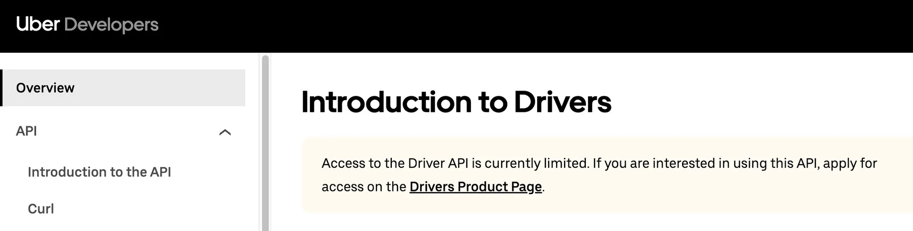

I found another page (https://drivers.uber.com/earnings/activities) that would let me look at my past rides, but frustratingly in a paginated week-by-week view. I had driven Uber for roughly 89 weeks, and with 15 results per page I’d be clicking at least 400 times just to list my rides. I thought there had to be a way around this. 

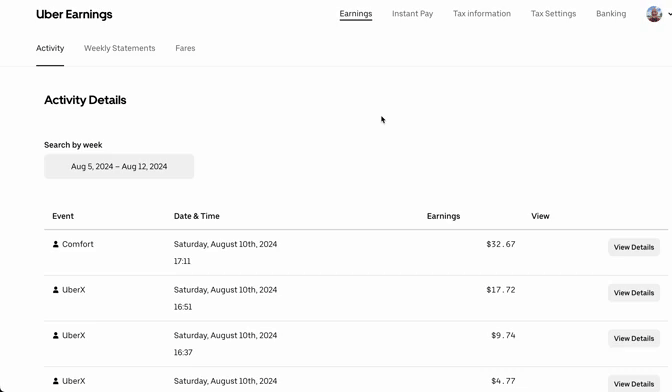

## Hacking The Data

I opened the Google Chrome Developer Tools, went to the Network tab, and refreshed the page on a week that had ride data. I was looking for a request that was providing the data for the listing of rides. 

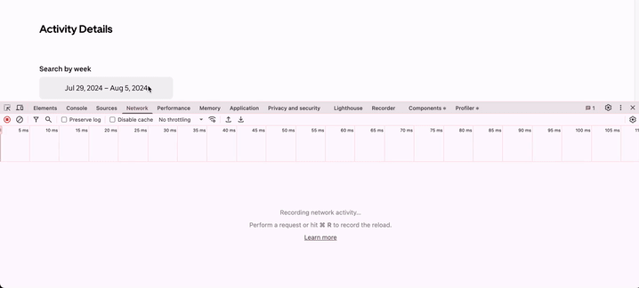

I found it! The request was being made to `https://drivers.uber.com/earnings/api/getWebActivityFeed?localeCode=en` with some request parameters in a POST header, and I was getting back a JSON response with details far richer than what was being displayed in the browser. The pagination flags were easy to find at the end of the JSON response. My task then was to replicate this request programmatically in Python, my language of choice for web scraping. 

To make things easier for myself, I leaned on [Postman](https://www.postman.com/)’s code generation capabilities. I first had to copy this Uber API request over from Google Chrome to Postman and replicate it there. There was surely going to be some authentication built in to the request, and instead of monkeying around with manually re-creating that I just used Google Chrome Dev Tool’s “Copy > Copy as cURL” on the request in the Network tab:

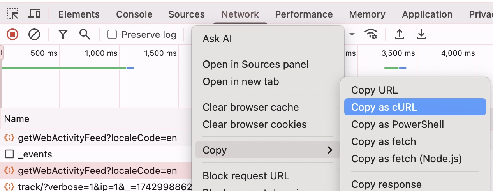

This copies to the clipboard a full cURL command with all parameters needed to replicate this on the command line. Postman can [import a cURL command](https://learning.postman.com/docs/getting-started/importing-and-exporting/importing-curl-commands/) and generate the request in its UI:

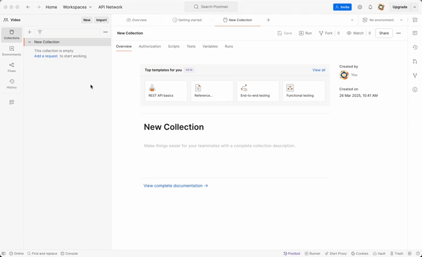

Wow! I was able to transfer the request to Postman, got it to work there, and it generated some Python code using the [requests](https://requests.readthedocs.io/en/latest/) library that I could easily copy over to my code editor and continue to work on there. 

Next step was to add support for pagination and ranging between the start date (1/9/2023) and end date (9/30/2024) so I could get all of my ride data. I created a new folder for my project, set up a Python3 [virtualenv](https://virtualenv.pypa.io/en/latest/), installed [Jupyter notebook](https://jupyter.org/install) and requests, and created a Jupyter notebook with the code to range through the pages and dates ([full code here](https://github.com/nrrb/uber-analytics-project/blob/main/scripts/get_uber_data.ipynb)). The main chunk of the scraping code is below, with the security tokens redacted for my specific request:

```python
from datetime import datetime, timedelta
import json
import requests
class UberDriver:
    def __init__(self):
        self.headers = {
          'accept': '*/*',
          'accept-language': 'en-US,en;q=0.9',
          'content-type': 'application/json',
          'cookie': 'REDACTED',
          'origin': 'https://drivers.uber.com',
          'priority': 'u=1, i',
          'referer': 'https://drivers.uber.com/earnings/activities',
          'sec-ch-ua': '"Not A(Brand";v="8", "Chromium";v="132", "Google Chrome";v="132"',
          'sec-ch-ua-mobile': '?0',
          'sec-ch-ua-platform': '"macOS"',
          'sec-fetch-dest': 'empty',
          'sec-fetch-mode': 'cors',
          'sec-fetch-site': 'same-origin',
          'user-agent': 'Mozilla/5.0 (Macintosh; Intel Mac OS X 10_15_7) AppleWebKit/537.36 (KHTML, like Gecko) Chrome/132.0.0.0 Safari/537.36',
          'x-csrf-token': 'x',
          'x-uber-earnings-seed': 'REDACTED'
        }
    
    def get_rides(self, start_date_iso, end_date_iso):        
        url = "https://drivers.uber.com/earnings/api/getWebActivityFeed?localeCode=en"
    
        payload = json.dumps({
          "startDateIso": start_date_iso,
          "endDateIso": end_date_iso,
          "paginationOption": {}
        })
        
        response = requests.request("POST", url, headers=self.headers, data=payload)
        data = response.json()

        rides = data['data']['activities']
        while data['data']['pagination']['hasMoreData']:
            payload = json.dumps({
              "startDateIso": start_date_iso,
              "endDateIso": end_date_iso,
              "paginationOption": {"cursor": data['data']['pagination']['nextCursor']}
            })
            response = requests.request("POST", url, headers=self.headers, data=payload)
            data = response.json()
            if data['data']['activities']:
                rides = rides + data['data']['activities']
        return rides or []

    def get_ride_detail(self, ride_uuid):
        # This is only helpful to get additional fare breakdown from Uber, if we wanted to analyze how much
        # Uber is taking from each fare.
        url = f"https://drivers.uber.com/earnings/trips/{ride_uuid}"
        response = requests.request("GET", url, headers=self.headers)
        return response.text

uber = UberDriver()

# This is the date I started working as an Uber driver; modify for your start date
start_date = datetime.strptime("2023-01-09", "%Y-%m-%d")
end_date = datetime.today()
current_date = start_date

rides = []
while current_date <= end_date:
    next_date = current_date + timedelta(days = 7)
    start_date_iso = current_date.strftime('%Y-%m-%d')
    end_date_iso = next_date.strftime('%Y-%m-%d')
    print(f"Getting rides for {start_date_iso} - {end_date_iso}...")
    new_rides = uber.get_rides(start_date_iso, end_date_iso)
    print(f"Retrieved {len(new_rides)} rides.")
    rides += new_rides
    current_date = next_date

# Let's dump all of these rides to a JSON file so we can reference this data outside of the script if need be, 
# or simply not have to retrieve from Uber again.
with open(f"data/rides_raw.json", "w") as file:
    json.dump(rides, file)

print(f"Retrieved {len(rides)} rides total.")
```

At the end, I was able to get all of my rides data! It took about 10 minutes to download it all, and this is entirely without delays in my code (e.g. `import time; time.sleep(0.1)`). Typically on a web scraping project I would add in some waits between requests to avoid hammering the API and hitting throttling/rate limiting, but in this case I was able to get away with it. 

The total file size for my 4379 rides was 4.9 MB ([rides_raw.json](https://github.com/nrrb/uber-analytics-project/blob/main/data/rides_raw.json)).

## Cleaning The Data

Upon further inspection, I found the data contained a lot of cruft clearly meant for just rendering the data on the web page. It was not meant for public consumption. 

```json
{
  "uuid": "d3096d6c-02bd-4f8e-855b-117588b27910",
  "recognizedAt": 1673809557,
  "activityTitle": "Comfort",
  "formattedTotal": "$10.72",
  "routing": {
    "webviewUrl": "https://drivers.uber.com/earnings/trips/d3096d6c-02bd-4f8e-855b-117588b27910",
    "deeplinkUrl": null
  },
  "breakdownDetails": { "formattedTip": "$1.00", "formattedSurge": null },
  "tripMetaData": {
    "formattedDuration": "15 min 56 sec",
    "formattedDistance": "3.9 mi",
    "pickupAddress": "N Ashland Ave, Chicago, IL 60614-1105, US",
    "dropOffAddress": "W Madison St, Chicago, IL 60612, US",
    "mapUrl": "https://static-maps.uber.com/map?width=360&height=100&marker=lat%3A41.92946%24lng%3A-87.66817%24icon%3Ahttps%3A%2F%2Fd1a3f4spazzrp4.cloudfront.net%2Fmaps%2Fhelix%2Fcar-pickup-pin.png%24anchorX%3A0.5%24anchorY%3A0.0&marker=lat%3A41.88207%24lng%3A-87.67135%24icon%3Ahttps%3A%2F%2Fd1a3f4spazzrp4.cloudfront.net%2Fmaps%2Fhelix%2Fcar-dropoff-pin.png%24anchorX%3A0.5%24anchorY%3A0.0&polyline=color%3A0xFF2DBAE4%24width%3A4%24enc%3Aaj%7C%7EF%60uavOyNV%7Ep%40O%60N%60Bp%5BuDn%7CEsD%5C%60Tc%40L%3FhE_B%40&signature=jOjTSurxb6QZGZQlr-tHwSUpbYc="
  },
  "type": "TRIP",
  "status": "COMPLETED"
}
```

A few problems:

1. The fare, surge, tip, distance, and duration for the ride was in a human-readable format, which is not helpful for numeric comparisons. 
2. The data was irregular, sometimes containing a field and sometimes having a null value. For example, if there was no tip or surge value, then `breakdownDetails` was null.
3. I didn’t need the `webviewUrl`, `deeplinkUrl`, or `mapUrl`, and the `uuid` was only useful internally to Uber. 
4. The `recognizedAt` seemed to be a UNIX timestamp indicating when the ride started, and I would have to extrapolate from that and the `formattedDuration` when the ride ended.
5. The pickupAddress and dropOffAddress were very general (clearly for safety purposes), and the ZIP was probably the most useful part.

## Cleaning The Data

As with any web scraping or data processing project, I had to write a fair amount of code to clean this up and shape it into a format I needed for further analysis. I used a combination of [Pandas](https://pandas.pydata.org/) and [regular expressions](https://docs.python.org/3/library/re.html) to clean it up ([full code here](https://github.com/nrrb/uber-analytics-project/blob/main/scripts/clean_uber_data.ipynb)).

```python
from datetime import datetime, timedelta
import re
import pandas as pd

rides_df = pd.read_json('../data/rides_raw.json')

# We need that sweet sweet trip metadata so drop any records that don't have it
rides_df = rides_df[rides_df['tripMetaData'].notnull()]
# Drop the useless routing and uuid columns
rides_df.drop(['routing', 'uuid'], axis=1, inplace=True)

# Count how many records have each number of keys and sort by key count
num_breakdown_keys = rides_df['breakdownDetails'].apply(lambda x: len(x) if isinstance(x, dict) else 0)
print(num_breakdown_keys.value_counts().sort_index())

rides_with_breakdown = rides_df[rides_df['breakdownDetails'].notnull()]
# I think this is only included if either the tip or surge value is non-zero. 
# Let's see if any records have zero for both.
breakdown_zero_valued = rides_with_breakdown['breakdownDetails'].apply(\
    lambda d: (d['formattedTip'] is None or d['formattedTip'] == '$0.00') \
            and (d['formattedSurge'] is None or d['formattedSurge'] == '$0.00'))
print(f"Number of records where both formattedTip and formattedSurge are zero or None: {breakdown_zero_valued.sum()}")

def fix_breakdown(bd):
    # If breakdownDetails is None or missing, return a default dictionary.
    if bd is None or pd.isnull(bd):
        return {'formattedTip': '$0.00', 'formattedSurge': '$0.00'}
    # Otherwise, if it's a dictionary, fix the individual keys.
    if isinstance(bd, dict):
        if bd.get('formattedTip') is None:
            bd['formattedTip'] = '$0.00'
        if bd.get('formattedSurge') is None:
            bd['formattedSurge'] = '$0.00'
    return bd

rides_df['breakdownDetails'] = rides_df['breakdownDetails'].apply(fix_breakdown)

def parse_currency_to_float(currency_str):
    clean_str = currency_str.replace('$', '').strip()
    return float(clean_str)

rides_df['tip'] = rides_df['breakdownDetails'].apply(lambda bd: parse_currency_to_float(bd['formattedTip']))
rides_df['surge'] = rides_df['breakdownDetails'].apply(lambda bd: parse_currency_to_float(bd['formattedSurge']))
rides_df.drop('breakdownDetails', axis=1, inplace=True)

def parse_time_to_seconds(time_str):
    matches = re.findall(r'(\d+)\s*(hr|min|sec)', time_str)
    unit_to_seconds = {'hr': 3600, 'min': 60, 'sec': 1}
    return sum(int(value) * unit_to_seconds[unit] for value, unit in matches)

def parse_miles(miles_str):
    match = re.search(r'(\d+\.?\d*)\s*mi', miles_str)
    if match:
        return float(match.group(1))

def extract_zipcode(address):
    zip_code_pattern = re.compile(r'\b\d{5}\b')
    match = zip_code_pattern.search(address)
    if match:
        return match.group()

rides_df['duration'] = rides_df['tripMetaData'].apply(lambda md: parse_time_to_seconds(md['formattedDuration']))
rides_df['distance'] = rides_df['tripMetaData'].apply(lambda md: parse_miles(md['formattedDistance']))
rides_df['pickup_address'] = rides_df['tripMetaData'].apply(lambda md: md['pickupAddress'])
rides_df['dropoff_address'] = rides_df['tripMetaData'].apply(lambda md: md['dropOffAddress'])
rides_df['pickup_zip'] = rides_df['pickup_address'].apply(lambda a: extract_zipcode(a))
rides_df['dropoff_zip'] = rides_df['dropoff_address'].apply(lambda a: extract_zipcode(a))
rides_df.drop('tripMetaData', axis=1, inplace=True)

rides_df['earnings'] = rides_df['formattedTotal'].apply(lambda t: parse_currency_to_float(t))
rides_df['base_pay'] = rides_df['earnings'] - rides_df['surge'] - rides_df['tip']
rides_df.drop('formattedTotal', axis=1, inplace=True)

rides_df['ride_start'] = rides_df['recognizedAt'].apply(lambda t: datetime.fromtimestamp(t))
rides_df['ride_end'] = rides_df['ride_start'] + rides_df['duration'].apply(lambda s: timedelta(seconds=s))
rides_df.drop('recognizedAt', axis=1, inplace=True)

rides_df = rides_df.rename(columns={'activityTitle': 'ride_type', 'type': 'ride_category'})

# I know these are the ride types (activityTitle) I'm interested in
passenger_ride_types = ['Business Comfort', 'Comfort', 'Share', 'Uber Pet',\
                        'UberX', 'UberX Priority', 'UberX Share', 'UberXL']
ride_categories = ['CT', 'TRIP']
print(f"Total passenger rides: {len(rides_df[rides_df['ride_type'].isin(passenger_ride_types)])}")
# How many completed passenger rides do we have?
rides_df = rides_df.query('status=="COMPLETED" and ride_category in @ride_categories and ride_type in @passenger_ride_types')
print(f"There are {len(rides_df)} completed passenger rides in this data.")

rides_df['id'] = rides_df.index
rides_df.to_csv('../data/rides.csv', index=False)
```

The crown jewel of all of this was a 796 KB CSV file with the data in consistent, easily digestible formats ([rides.csv](https://github.com/nrrb/uber-analytics-project/blob/main/data/rides.csv)). Here are a few of the cleaned records:

```csv
ride_type,ride_category,status,tip,surge,duration,distance,pickup_address,dropoff_address,pickup_zip,dropoff_zip,earnings,base_pay,ride_start,ride_end,id
Comfort,TRIP,COMPLETED,1.0,0.0,956,3.9,"N Ashland Ave, Chicago, IL 60614-1105, US","W Madison St, Chicago, IL 60612, US",60614,60612,10.72,9.72,2023-01-15 14:05:57,2023-01-15 14:21:53,0
UberX,TRIP,COMPLETED,0.0,0.0,835,2.4,"N Lincoln Ave, Chicago, IL 60613, US","N Southport Ave, Chicago, IL 60614, US",60613,60614,4.13,4.13,2023-01-15 13:45:31,2023-01-15 13:59:26,1
UberX,TRIP,COMPLETED,3.0,0.0,642,1.6,"N Clifton Ave, Chicago, IL 60657-2224, US","N Lincoln Ave, Chicago, IL 60613, US",60657,60613,7.56,4.56,2023-01-15 13:33:41,2023-01-15 13:44:23,2
UberX,TRIP,COMPLETED,3.0,3.75,713,1.5,"W Belmont Ave, Chicago, IL 60657-4511, US","3001 N Ashland Ave, Chicago, IL 60657, US",60657,60657,11.19,4.4399999999999995,2023-01-15 13:17:41,2023-01-15 13:29:34,3
```

## Insights


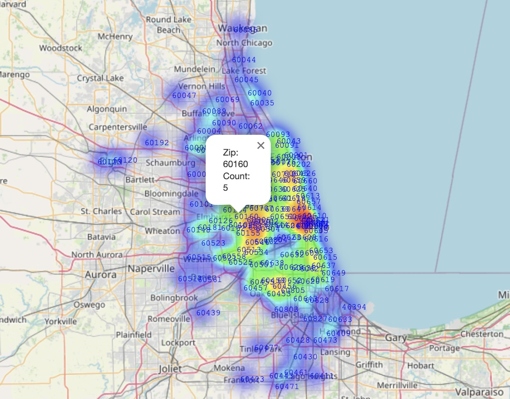

I've been using this in many ways to look back on the time I spent driving for Uber around Chicago at all hours of the day, in all different neighborhoods, in all types of weather, on all days of the week, and picking up all ages of people (and some cats, dogs, and bunnies too 🐇). 

To start, let me show you some things I learned about strategically making more
# 💰**MONEY**💰

With Uber driving, outside of surge pricing, it's all about the tips. I wanted to get insights on what factors lead to maximal tips. 

1. What time of day should I drive to maximize tips?
2. What day of the week should I drive to maximize tips?
3. What ride type (UberX, Comfort, Pet, etc) lead to maximal tips?
4. What are the top 5 ZIP codes to pick up from to maximize tips?

For each day I totaled the tips on the hour of day (e.g. 4:00 - 4:59 PM), then found the average of total tips across all days and divided by the number of days to find the average total tips per hour of day. 

Below are the key insights. If you want to see the Python code I used to do this analysis and generate the charts using [Seaborn](https://seaborn.pydata.org/) (which makes charting easier for me than plain [Matplotlib](https://matplotlib.org/)), you can find my full analysis Jupyter notebook on my Github repo here: [Tip Analysis.ipynb](https://github.com/nrrb/uber-analytics-project/blob/main/notebooks/Tip%20Analysis.ipynb)

**Caveats**: This is based on the times and days I drove, and I didn't drive every hour of every day. This also doesn't take into account outliers, like if someone gave me a $50 tip one night. 

### 1. What time of day should I drive to maximize tips?

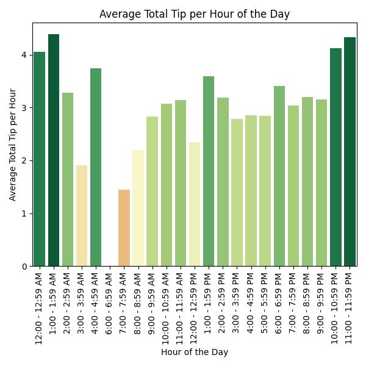

The best time of day overall was 1:00 - 1:59 AM with an average total tip per hour of $4.383514. 

### 2. What day of the week should I drive to maximize tips?

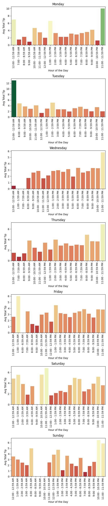

The best day to drive was Saturday, with an average total tip per hour of $3.758764.

### 3. What ride type (UberX, Comfort, Pet, etc) lead to maximal tips?

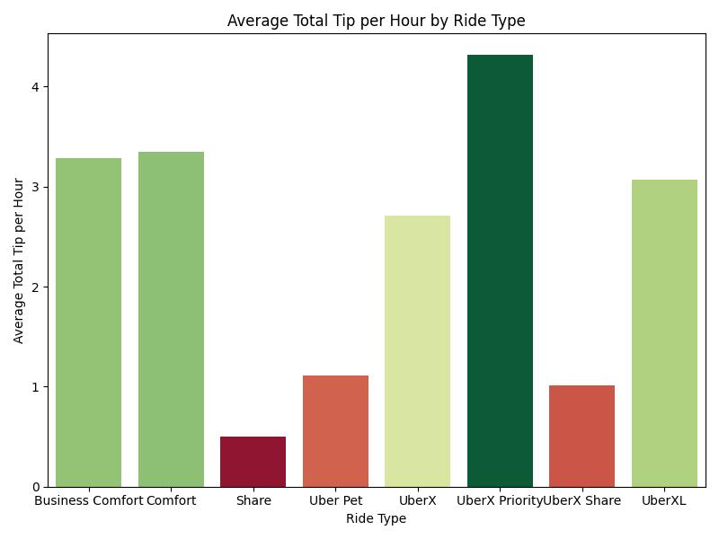

The best ride type was UberX Priority, with an average total tip per hour of $4.314286. Since this ride type is not selectable in the Uber Driver app (it comes up occasionally as an offering when driving UberX), based on the chart you can see that the next best ride type is Comfort.

### 4. What are the top 5 ZIP codes to pick up from to maximize tips?

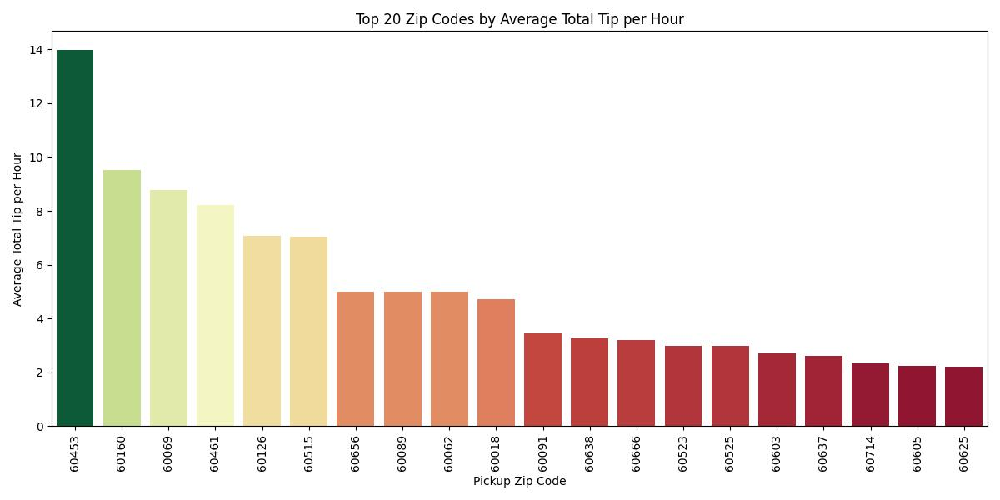

The top 5 ZIP codes to pick up from to maximize average total tip per hour were:

```
    pickup_zip  avg_tip_total
       60453      13.980000
       60160       9.526667
       60069       8.790000
       60461       8.230000
       60126       7.075000
```

### Beyond Tips

To give you a little more insight into the data beyond the tips, here are some more charts again using [Seaborn](https://seaborn.pydata.org/).

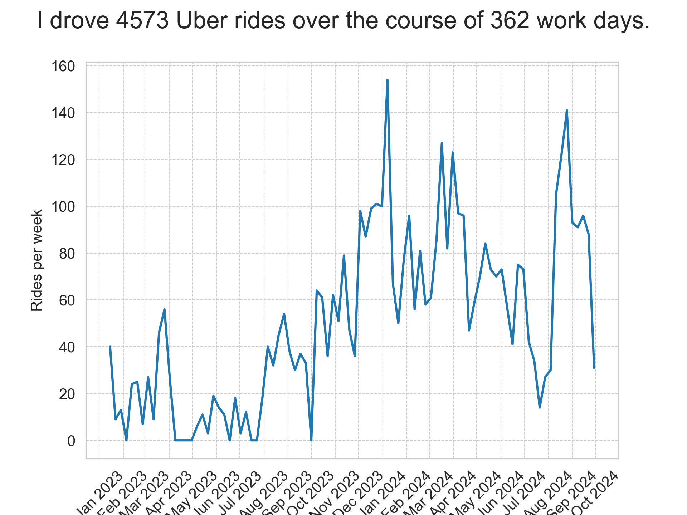

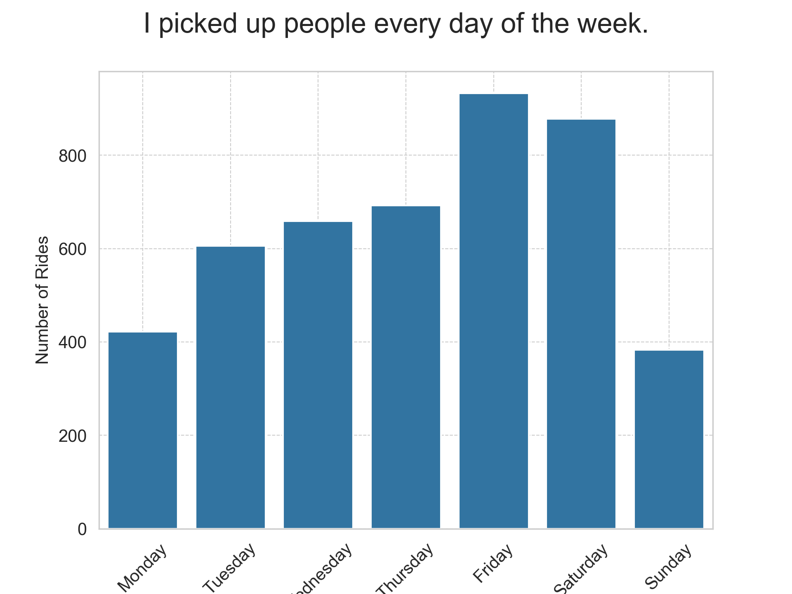

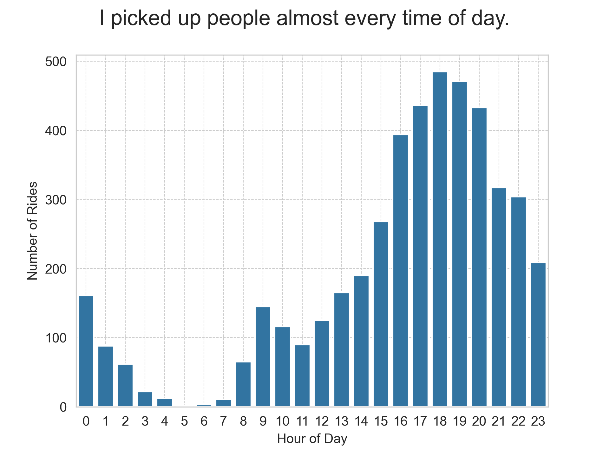

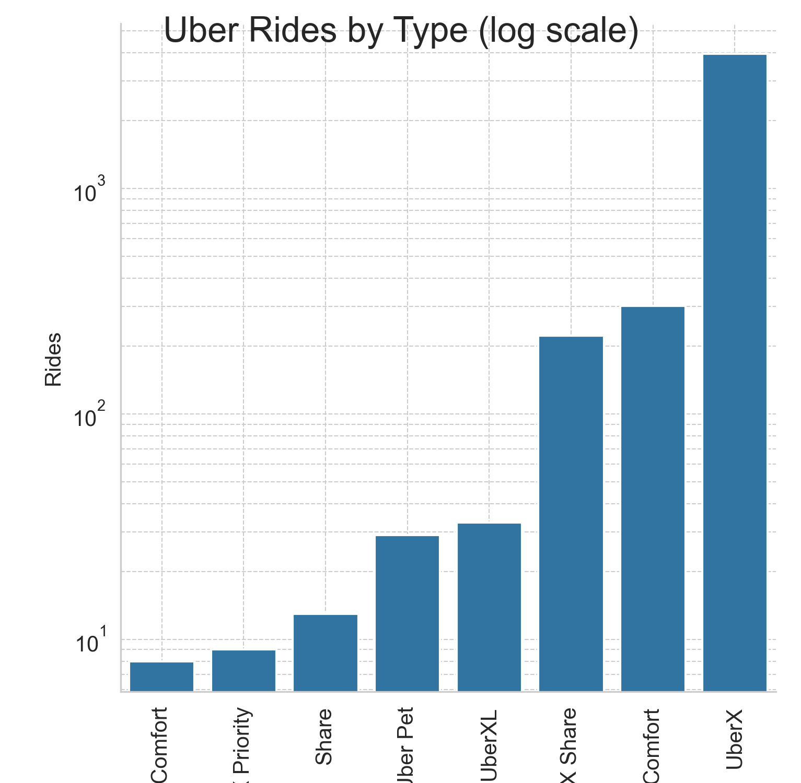

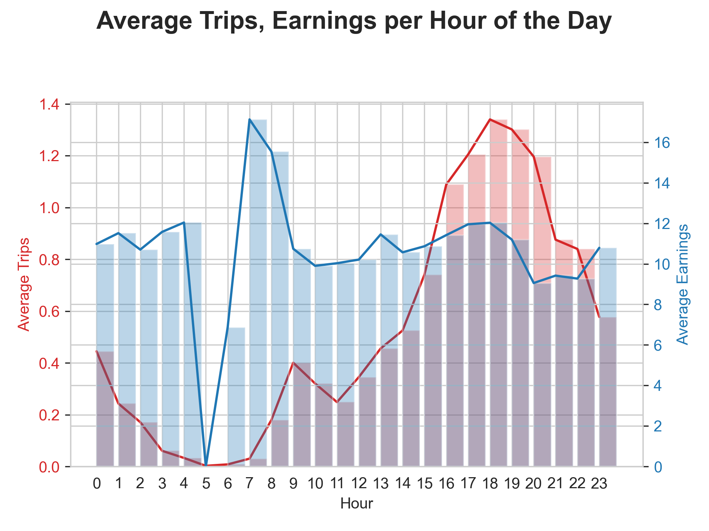

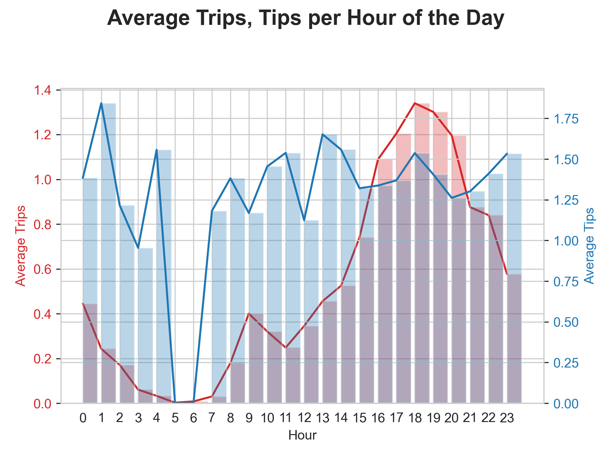

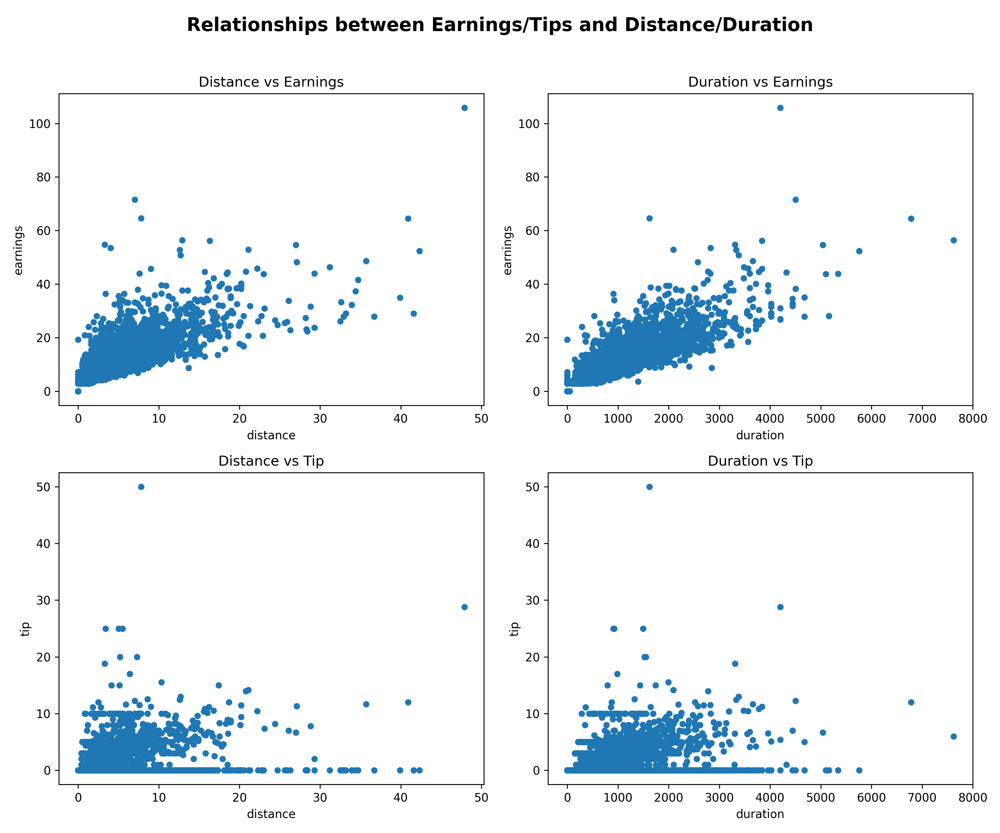

P.S. - The code I used to generate that heatmap up there was with [Folium](https://python-visualization.github.io/folium/latest/) using this script: [Zip Code Heatmap](https://github.com/nrrb/uber-analytics-project/blob/main/notebooks/ZIP%20Code%20Heatmap.ipynb)

You can interact with it live here: [chicago_map.html](./visualizations/chicago_map.html)

## Conclusion

In the end, I didn’t let Uber’s limited interface hold me back. I took control. By reverse-engineering hidden endpoints and automating the extraction of thousands of rides, I transformed a mess of paginated data into an easy-to-use 796 KB CSV that tells the real story of my driving history. This isn't just about web scraping. It’s about demonstrating how to relentlessly pursue actionable insights even when the system won’t hand you the answers.

Using simple tools like Google Chrome Developer Tools, Postman, and Python, I turned an overwhelming set of fragmented records into a clean, coherent dataset that properly reflects my driving experience. The journey from tedious clicks to a robust dataset is a testament to my ability to innovate and overcome data barriers, skills that I bring to every challenge I face.

If you’re a hiring manager looking for someone who thinks creatively about ways to overcome complex obstacles, or a fellow driver seeking new ways to understand your performance, I’d love to talk. Let’s transform data frustrations into opportunities together. Thanks for reading, and I look forward to continuing the conversation.

---

If you appreciate a hands-on, data-driven approach and believe in seizing control, let’s connect. I’m always open to exploring new challenges and opportunities.

**Contact Me:**  
[LinkedIn](https://www.linkedin.com/in/nicholasrrbennett) | [Email](mailto:nicholasbennett.work@gmail.com) | [GitHub](https://github.com/nrrb)
