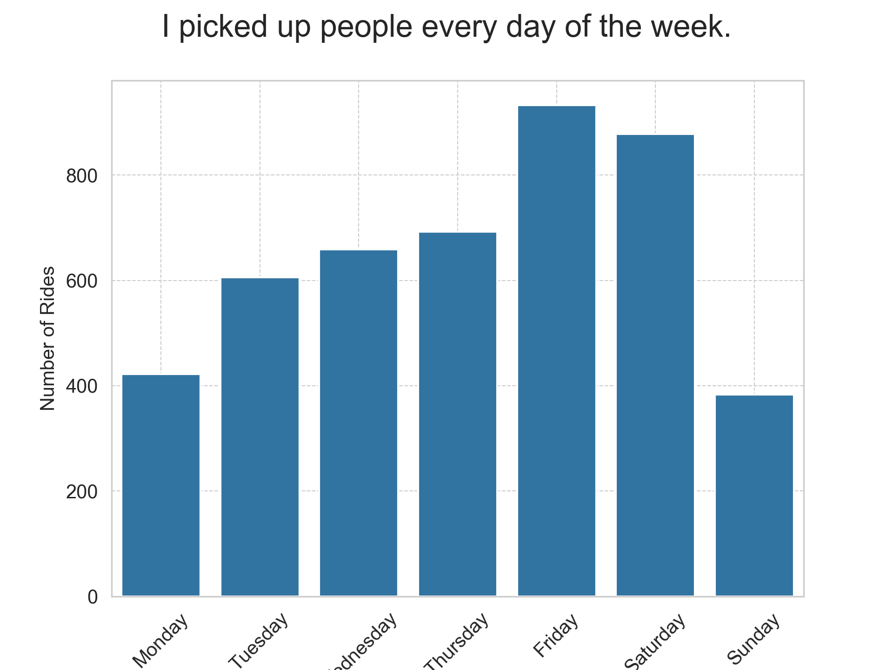

# Uber Earnings & Trip Pattern Analysis

A deep dive into my Uber driving history to uncover earnings trends, peak hours, tip behavior, and optimal driving strategies using Python, pandas, and data visualization.

[Interactive map](https://nrrb.github.io/uber-analytics-project/chicago_map.html) made with [Folium](https://python-visualization.github.io/folium/latest/#).

## ☀️⛈️🌪️❄️
I drove in every kind of weather, from the coldest deep freeze in Chicago to the days above 100 F, from droughts to torrential rainstorms to blinding blizzards. 

## ⭐️⭐️⭐️⭐️⭐️ 
By the end I had an average rating of 4.98 stars (calculated on the previous 500 rides). Most of the time I was averaging 5.00 stars. 

## Key Findings

* 📊 Peak Hours: _to be determined_
* 🚖 Most Profitable Rides: _to be determined_
* 💰 Tip Behavior: _to be determined_
* 📍 Geospatial Insights: _to be determined_

## Visuals

_to be created_

## Code Walkthrough

_to be created_

## How to Run the Project

1. Clone this repository to your computer. On a macOS computer, I would do this by opening a terminal, changing directory into my code folder, and doing `git clone https://github.com/nrrb/uber-analytics-project.git`.
2. Install a Python virtual environment and install the requirements. From the CLI, I would do this by first changing directory into the newly cloned repository, followed by `python3 -m venv venv && source venv/bin/activate && pip install -r requirements.txt`. 
3. Launch Jupyter notebook and open the notebooks. I start Jupyter from the CLI by simply entering `jupyter notebook` and navigating from the Jupyter web interface that automatically opens in my browser.

If you have "batteries included" Python distribution like [Anaconda](https://www.anaconda.com/) then there should be tools available there for importing and opening a project from a Github repository.

## Blog Post & LinkedIn Article

_to be created_

## Credit

Made by Nicholas Bennett ([LinkedIn](https://www.linkedin.com/in/nicholasrrbennett)).
