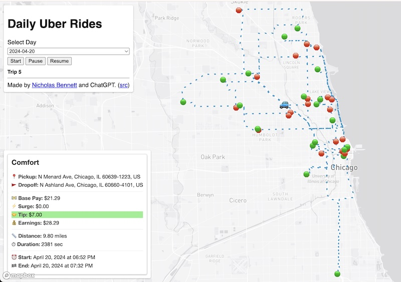
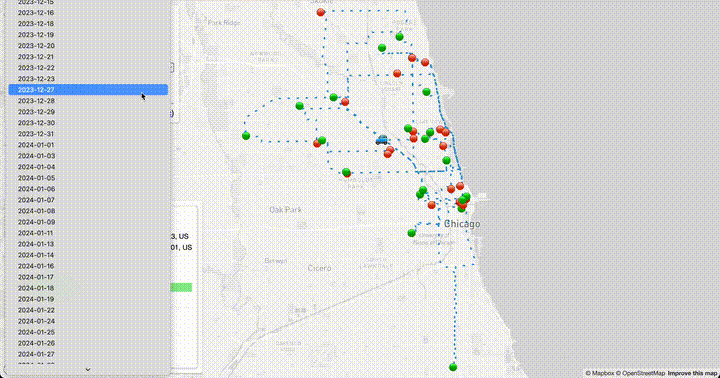

## Introduction

Have you ever seen a product in your mind's eye but been unsure of how to create it? 

Imagine you’re a full-time Uber driver. What if you could watch every mile of your Uber driving history come to life on a map?

In 2023 and 2024 I drove a total of 4379 Uber rides, and I was able to scrape the Uber Drivers page to get this data ([see how I did this here](https://dev.to/nrrb/how-i-hacked-ubers-hidden-api-to-download-4379-rides-35ai)). I invested countless hours in this work, exploring Chicago's neighborhoods and meeting so many interesting people, and I didn't want this experience to be relegated to a CSV. I wanted a **living visual** (built using what I now understand is called vibe coding: creative, exploratory programming powered by AI assistance).



I envisioned an animated map showing all the trips I took and how I moved between them. This was something I could show to my family and friends, explaining to them where I went better than raw data or mere numbers. More importantly, it would help jog my memory of my myriad experiences.

I just didn't have much experience in web animation or GIS, and I balked when I thought of the time investment and frustrations along the way to get to what I wanted. 

> **TL;DR:**  
> I scraped 4379 Uber rides, geocoded the routes, and used AI-assisted vibe coding with ChatGPT to build an animated map of every trip — day by day — using Python, Mapbox, and GeoJSON. [Here it is!](https://nrrb.github.io/uber-analytics-project/visualizations/animation/rides.html)

## The Vibe Coding Process

Thankfully, now with the power of code-aware LLMs, it's possible to get mostly functional examples of code based on plain English descriptions and be able to iterate through versions with the LLM. In this article I specifically used ChatGPT, with a combination of their [o3-mini-high](https://platform.openai.com/docs/models/o3-mini) (more code-correct) and [ChatGPT 4o](https://platform.openai.com/docs/models/gpt-4o) models. My development process was roughly `{LLM: initial prompt} -> {manual tweaking} -> {LLM: code tweaking, feature adding, debugging} -> {manual tweaking} ...`. 

In this article I'll show you the power of using LLMs and vibe coding in conjunction with language fluency (in this project, Python and JavaScript) to bring an idea to life. When facing domains I didn't have a lot of experience in (GIS and web animation), and being a learner more from examples than reference, it was extremely helpful to get examples of semi-working code from the LLM and then be able to learn concepts backwards. 

Even this article is somewhat vibe-coded. I gave ChatGPT a prompt that it's an award-winning and viral writing coach and asked it for a narrative structure and a number of catchy titles. It broadly outlined the article and I iterated with it to find the title that was most "me". The prose in the body of this article is all me, but the skeleton was aided considerably by AI. I used it as well to analyze my language and point out potential readability issues in my language, considering my audience of fellow coders and hiring managers for the kinds of roles I want. 

## The Challenge

Having the intuitive sense that an animation of all 4379 rides at once would be spaghetti on the map and unintelligible, I realized I'd want to show my Uber driving day-by-day. Since I often drove late into the night for people going out, I had to unconventionally set my "day" to 5:00 AM - 4:59 AM the next day. 

I also knew that the addresses in my data were non-specific:

```python
In [1]: import pandas as pd
In [2]: rides = pd.read_csv('../../data/rides.csv')
In [3]: rides['pickup_address'].head()
Out[3]: 
0    N Ashland Ave, Chicago, IL 60614-1105, US
1         N Lincoln Ave, Chicago, IL 60613, US
2    N Clifton Ave, Chicago, IL 60657-2224, US
3    W Belmont Ave, Chicago, IL 60657-4511, US
4     N Whipple St, Chicago, IL 60647-3821, US
Name: pickup_address, dtype: object
```

I would need a robust geocoding service that could handle these locations. The geocoding would result in (latitude, longitude) coordinates for each `pickup_address` and `dropoff_address`. 

I also didn't want to just draw lines between these coordinates, which would ignore real streets. So I needed a routing API to give me street-based paths based on two lat/long coordinates. 

From these routes, I would then want to display them on a live map on the web. I knew I needed a third API to show a map overlaid with markers and paths. I just didn't know what format of data this would require.

## Solution Exploration with ChatGPT

Through talking to ChatGPT, I was able to learn a lot more about GIS, specifically that these paths would be called geometries and that I could store these as GeoJSON files which would then be usable in a live map. 

Here's a prompt I used to start to get familiar with the technology out there:

> I have a list of locations with zip code and sometimes a street name, but no specific house numbers. They are time stamped. I want to build an animation of movement between these points in a car, using roads that one would take between those locations using routing software like Google Maps. 
> How could I do this?
> Alternately, how could I generate the GPX file so I could use it with third party software?

I had learned about GPX files from some map animation apps I'd explored, which had paid tiers. I thought if I couldn't find a way to do it myself, then I could at least get the files and feed them to the external service. I found out in this line of questioning, however, that I wouldn't need an external service and that GeoJSON would be more suitable for my task. 

I then asked it these clarifying questions:

> Explain the difference between the Leaflet and Mapbox GL JS options
> I definitely want to use Mapbox GL JS. I might break up animation on a day by day basis in which case there’d be a maximum of 50 locations per day. But I might also want to animate the entire data set which is then 4300 locations

It gave me a full breakdown of how I could do this with all three APIs I was looking for coming from Mapbox. Now I was concerned about cost, because I'm on a very limited budget for this personal project:

> What is the cost of the Mapbox directions API for route finding? Give me recommendations with price comparisons on getting road routing information given my data set is 4300 points. 

Thankfully, it told me that Mapbox has a free tier which allows for 100K queries in a month. It showed me a few other services, but Mapbox was clearly the winner with a cohesive set of APIs and beautiful map tiles. It offered:

> What I’d Do in Your Shoes
> Start with Mapbox: You’re under the 100,000 req/month and using Mapbox GL JS.
> Throttle batch calls and cache results as GeoJSON to avoid repeated API hits.
> If you exceed quota later, move to ORS or self-host OSRM.
> Want a script to:
> Cache route requests to disk as GeoJSON or GPX?
> Automatically throttle and deduplicate?
> Let me know — I can write that out for you.

    
I told it "Yes". **Here we go!**

## Step 1: Geocoding and Routing with Mapbox

ChatGPT provided me an overview of the work it was going to do, enlightening me to details I hadn't even thought to ask, and it gave me some clarifying questions so it could work better:

> Awesome. Here's what I’ll provide:
> 1. A **Python script** that:
> - Reads your list of 4300+ locations.
> - Sends route requests to **Mapbox Directions API** (or OpenRouteService).
> - **Throttles** requests to stay within rate limits.
> - **Caches** all responses locally (as GeoJSON) to avoid repeat API calls.
> - Optionally writes a combined **GPX** or **GeoJSON** route file for animation or import.
> 2. Modular design so you can easily switch routing backends (Mapbox or ORS).
> 
> **Questions Before I Start**
>
> To make this precise for you, please confirm the following:
> 1. **Format of your input**:
> - Is it a CSV file?
> - What columns does it have? (e.g., `timestamp`, `zip`, `street`, `lat`, `lon`, etc.)
> 2. Do you already have **latitude/longitude**, or do I need to **geocode** from zip/street?
> 3. Which routing backend would you like to start with?
> - **Mapbox Directions API**
> - **OpenRouteService (ORS)**
> - (We can swap easily later.)
> 4. Do you want the output to be:
> - One long GPX file?
> - One file per day?
> - Both?
>
> Once I have those answers, I’ll write your script.


I told it:

> Input is a CSV file. It has columns address, zip, timestamp. You need to geocode from address ideally or fall back to zip if that doesn’t work or if results are ambiguous. Start with Mapbox Directions API. Both outputs.

It asked for a sample of my data, so I uploaded my entire 796 KB `rides.csv` file. I had to provide clarifying prompts subsequently for some pertinent details:

1.  The start address was in the `pickup_address` column and the end address was in the `dropoff_address` column.
2. I wanted a route between the end address of one ride to the start address of the next ride.
3. The ZIP was actually in the address fields already so it could ignore the `zip` column.
4. I didn't need GPX output after all and it could just generate GeoJSON.
5. I didn't need a combined GeoJSON file of all routes, I just wanted them broken out by day.
6. I wanted to filter out any rides where the geocoded address was more than 100 miles from the center of Chicago (some addresses were so generic that they geocoded to Montana).
7. It kept trying to run the Python code in chat session (!!) so I told it I wanted a script I could run locally.
8. That a day would end at 5 AM instead of midnight.
9. I wanted to add metadata to each feature (an individual route between points within the resulting GeoJSON file) from `rides.csv`, particularly whether it was an actual ride or a transition between rides.
10. I wanted debugging information displayed to the console so I could see progress of the script. 
11. I wanted it to bake in retries of the API endpoints with waits in case there were network problems.

Based on the example it provided of adding metadata to the GeoJSON features, I added in my own code to add additional metadata to `ride` features from `rides.csv` including `timestamp`, `ride_start`, `ride_end`, `ride_type`, `pickup_address`, `dropoff_address`, `base_pay`, `surge`, `tip`, `earnings`, `duration`, and `distance`.

I created a Mapbox account, created a [private key](https://docs.mapbox.com/help/getting-started/access-tokens/) for doing these requests to the [Mapbox Geocoding v5 API](https://docs.mapbox.com/api/search/geocoding-v5/) and [Mapbox Directions v5 API](https://docs.mapbox.com/api/navigation/directions/), stored that locally in a `.env` file, and loaded that with the [python-dotenv](https://pypi.org/project/python-dotenv/) library.

**Amazingly, this script worked on first run!**

```python
import pandas as pd
import hashlib
import requests
import time
import json
import os
from pathlib import Path
from collections import defaultdict
import math
from dotenv import load_dotenv

load_dotenv()

MAPBOX_TOKEN = os.getenv('MAPBOX_TOKEN')
INPUT_CSV = "../../data/rides.csv"
CACHE_FILE = "cache.json"
OUTPUT_DIR = "output/geojson"
GEOCODE_BASE = "https://api.mapbox.com/geocoding/v5/mapbox.places/"
DIRECTIONS_BASE = "https://api.mapbox.com/directions/v5/mapbox/driving/"
MAX_RETRIES = 3
RETRY_DELAY = 2

CHICAGO_LAT = 41.8781
CHICAGO_LON = -87.6298
MAX_MILES = 100

# Initialize cache
Path(OUTPUT_DIR).mkdir(parents=True, exist_ok=True)
if os.path.exists(CACHE_FILE):
    with open(CACHE_FILE) as f:
        cache = json.load(f)
else:
    cache = {}

def save_cache():
    with open(CACHE_FILE, "w") as f:
        json.dump(cache, f)

def cache_key(*args):
    return hashlib.md5("::".join(args).encode()).hexdigest()

def haversine(lat1, lon1, lat2, lon2):
    R = 3958.8  # miles
    phi1, phi2 = math.radians(lat1), math.radians(lat2)
    d_phi = phi2 - phi1
    d_lambda = math.radians(lon2 - lon1)
    a = math.sin(d_phi / 2) ** 2 + math.cos(phi1) * math.cos(phi2) * math.sin(d_lambda / 2) ** 2
    return 2 * R * math.asin(math.sqrt(a))

def is_valid_point(lat, lon):
    return haversine(lat, lon, CHICAGO_LAT, CHICAGO_LON) <= MAX_MILES

def safe_request(url):
    for attempt in range(MAX_RETRIES):
        try:
            r = requests.get(url)
            if r.status_code == 200:
                return r.json()
            print(f"[HTTP {r.status_code}] {url}")
        except Exception as e:
            print(f"[Request Failed] {e}")
        time.sleep(RETRY_DELAY)
    return None

def geocode(address):
    print(f"[GEOCODE] {address}")
    key = cache_key("geocode", address)
    if key in cache:
        return cache[key]
    url = f"{GEOCODE_BASE}{requests.utils.quote(address)}.json?access_token={MAPBOX_TOKEN}&limit=1"
    data = safe_request(url)
    coords = None
    if data and data.get("features"):
        coords = data["features"][0]["geometry"]["coordinates"]
        # Filter out-of-bounds geocoded results
        if not is_valid_point(coords[1], coords[0]):
            print(f"[SKIPPED] Geocoded point {coords} too far from Chicago")
            coords = None
    cache[key] = coords
    return coords

def route_between(c1, c2):
    if not is_valid_point(c1[1], c1[0]) or not is_valid_point(c2[1], c2[0]):
        print(f"[SKIPPED] One or both points out of range: {c1}, {c2}")
        return None

    print(f"[ROUTE] {c1} -> {c2}")
    key = cache_key("route", str(c1), str(c2))
    if key in cache:
        return cache[key]

    coords_str = f"{c1[0]},{c1[1]};{c2[0]},{c2[1]}"
    url = f"{DIRECTIONS_BASE}{coords_str}?access_token={MAPBOX_TOKEN}&geometries=geojson"
    data = safe_request(url)

    geometry = None
    if data and data.get("routes"):
        route = data["routes"][0]["geometry"]
        coords = route.get("coordinates", [])
        coords = [pt for pt in coords if is_valid_point(pt[1], pt[0])]
        if coords:
            route["coordinates"] = coords
            geometry = route
        else:
            print("[SKIPPED] All route points filtered out as outliers")

    cache[key] = geometry
    return geometry

def save_geojson(day, features):
    geojson = {
        "type": "FeatureCollection",
        "features": features
    }
    out_path = os.path.join(OUTPUT_DIR, f"{day}.geojson")
    with open(out_path, "w") as f:
        json.dump(geojson, f)
    print(f"[SAVED] {out_path}")

rides_df = pd.read_csv(INPUT_CSV)
rides_df["ride_start"] = pd.to_datetime(rides_df["ride_start"])
rides_df = rides_df.sort_values("ride_start")

# Geocode pickup and dropoff
rides_df["pickup_coords"] = rides_df["pickup_address"].apply(geocode)
rides_df["dropoff_coords"] = rides_df["dropoff_address"].apply(geocode)
rides_df = rides_df[rides_df["pickup_coords"].notnull() & rides_df["dropoff_coords"].notnull()]

routes_by_day = defaultdict(list)

for i in range(len(rides_df)):
    ride = rides_df.iloc[i]
    ride_time = ride["ride_start"]
    if ride_time.time() < pd.to_datetime("05:00").time():
        day = (ride_time - pd.Timedelta(days=1)).date()
    else:
        day = ride_time.date()

    # 1. pickup -> dropoff
    geometry1 = route_between(ride["pickup_coords"], ride["dropoff_coords"])
    if geometry1:
        routes_by_day[day].append({
            "type": "Feature",
            "geometry": geometry1,
            "properties": {
                "timestamp": ride["ride_start"].isoformat(),
                "type": "ride",
                "rideType": ride["ride_type"],
                "pickupAddress": ride["pickup_address"],
                "dropoffAddress": ride["dropoff_address"],
                "basePay": f"{float(ride['base_pay']):.2f}",
                "surge": f"{float(ride['surge']):.2f}",
                "tip": f"{float(ride['tip']):.2f}",
                "earnings": f"{float(ride['earnings']):.2f}",
                "duration": f"{int(ride['duration'])}",
                "distance": f"{float(ride['distance']):.2f}",
                "rideStartTime": ride['ride_start'].strftime("%B %d, %Y at %I:%M %p"),
                "rideEndTime": pd.to_datetime(ride['ride_end']).strftime("%B %d, %Y at %I:%M %p")
            }
        })

    # 2. dropoff -> next pickup (if available)
    if i < len(rides_df) - 1:
        next_ride = rides_df.iloc[i + 1]
        geometry2 = route_between(ride["dropoff_coords"], next_ride["pickup_coords"])
        if geometry2:
            routes_by_day[day].append({
                "type": "Feature",
                "geometry": geometry2,
                "properties": {
                    "timestamp": next_ride["ride_start"].isoformat(),
                    "type": "transition"
                }
            })

for day, features in routes_by_day.items():
    save_geojson(str(day), features)

save_cache()
print("✅ Done generating cleaned route files.")
```

Voila! Now I had 339 individual daily GeoJSON files in my [output/geojson](https://github.com/nrrb/uber-analytics-project/tree/main/visualizations/animation/output/geojson) folder. 

## Step 2: Building Interactive Map with Mapbox GL JS and Turf.js

All of these files won't do me much good unless I can visualize them. I don't want to replicate the full set of iterations of prompts I gave ChatGPT to generate this, because this was hundreds of prompts over several days. The steps were a variety of:

1. I tried AI-assisted tweaks that didn't work out the way I wanted, 
2. went back to previous versions, 
3. sent my manually tweaked code to ChatGPT to update its memory, 
4. pasted in errors from the browser's dev console to debug them, 
5. did considerable additions to the code myself after I learned how it all worked by example.

I also had to write [my own script](https://github.com/nrrb/uber-analytics-project/blob/main/visualizations/animation/generate_days.py) to produce the static array of GeoJSON file paths in the file [days.js](https://github.com/nrrb/uber-analytics-project/blob/main/visualizations/animation/days.js), since I knew I'd be hosting this on Github Pages and I wasn't sure if the client-side script would be able to access an index listing of the `output/geojson` file. 

Instead, of showing you every prompt I used over all the days, let me offer you a reverse-generated prompt. I gave ChatGPT the final HTML/JS code and asked it:

> This is the actual HTML/JS produced, make a prompt that would generate this. Tailor this for use with ChatGPT AI using specifically the o3-mini-high model. Give me the prompt in a format I can easily copy and paste to use in a Markdown document.
> <inserted HTML/JS code>

The prompt it gave me, which I think describes the project well, is:

> Prompt for ChatGPT (o3-mini-high): Route Animation Web App
>
> Build a complete `index.html` file that displays an animated driving route using **Mapbox GL JS**. The animation should read from a local **GeoJSON file per day** and animate a car marker driving the route point-by-point.
> 
> 🗺️ 1. Map
>
> - Use Mapbox GL JS v2.15.
> - Set center to `[-87.65, 41.9]` (Chicago).
> - Use the light map style.
> - Load and display a route as a dashed, semi-transparent **blue** line.
> 
> 📦 2. Data Input
>
> - Route data comes from a local GeoJSON file: `output/geojson/{DAY}.geojson`.
> - The file contains a `FeatureCollection` with multiple `LineString` features.
> - Each feature has `properties.type` of either `"ride"` or `"transition"`, and may include:
>   - `pickupAddress`, `dropoffAddress`, `basePay`, `tip`, `surge`, `earnings`
>   - `distance`, `duration`, `rideType`, `rideStartTime`, `rideEndTime`
> 
> 🚙 3. Animation
>
> - Animate a `🚙` emoji marker along the entire route.
> - Calculate a per-coordinate animation delay:
>   - For `"ride"` features with `duration`, use:  
>     `(duration / 400) * 1000 / number_of_coordinates`
>   - Use a fixed default delay of `100ms` for all other segments.
> - On each animation step:
>   - Move the marker to the next coordinate.
>   - Update the **trip number**.
>   - Show a trip description panel with styled HTML and emojis.
> 
> 📍 4. Start/End Markers
>
> - For each `"ride"` feature:
>   - Add a 🟢 marker at the start
>   - Add a 🛑 marker at the end
>   - On hover, show a popup with the ride description
> 
> 📆 5. UI
>
> - Include:
>   - A `<select>` dropdown to choose a day
>   - **Start / Pause / Resume** buttons
>   - A **trip info display panel** at the bottom left
> - Load available days from `days.js`, which defines:  
>   `var days = ["2024-01-06", "2024-01-07", ...]`
> - Randomly pick a default day on load and auto-start the animation
> 
> 💅 6. Style
>
> - All CSS should be included in a `<style>` tag
> - Use rounded corners, soft shadows, and a clean sans-serif font
> - Style popup cards to show structured ride info with emoji icons
> - Route line should use:
>   - A dashed stroke
>   - Blue color (`#007cbf`)
>   - 80% opacity
> 
> 🔧 Dependencies (no build tools)
>
> Only use:
> - `https://api.mapbox.com/mapbox-gl-js/v2.15.0/mapbox-gl.js`
> - `https://cdn.jsdelivr.net/npm/@turf/turf@6/turf.min.js`
> **Output must be a standalone `index.html` file.**

I used a [public key from the Mapbox API](https://docs.mapbox.com/help/getting-started/access-tokens/#public-tokens), which it states is built to be shared publically and seen in client-side code. Here's the final [rides.html](https://nrrb.github.io/uber-analytics-project/visualizations/animation/rides.html):

```javascript
<!DOCTYPE html>
<html>
  <head>
    <meta charset="utf-8" />
    <title>Route Animation</title>
    <meta name="viewport" content="initial-scale=1, maximum-scale=1, user-scalable=no" />
    <link href="https://api.mapbox.com/mapbox-gl-js/v2.15.0/mapbox-gl.css" rel="stylesheet" />
    <style>
      body {
        margin: 0;
        padding: 0;
      }
      #map {
        position: absolute;
        top: 0;
        bottom: 0;
        width: 100%;
      }
      #controls {
        position: absolute;
        top: 10px;
        left: 10px;
        z-index: 1;
        background: white;
        padding: 10px;
        border-radius: 4px;
        box-shadow: 0 1px 3px rgba(0, 0, 0, 0.3);
        font-family: sans-serif;
      }
      #descriptionDisplay {
        position: absolute;
        bottom: 10px;
        left: 10px;
        z-index: 1;
        background: white;
        padding: 10px;
        border-radius: 4px;
        box-shadow: 0 1px 3px rgba(0, 0, 0, 0.3);
        font-family: sans-serif;        
      }
      label,
      select {
        display: block;
        margin-bottom: 6px;
        width: 100%;
      }
      #status {
        margin-top: 10px;
        font-weight: bold;
        font-size: 14px;
      }
      .mapboxgl-popup {
        z-index: 100 !important;
      }
      .popup-content {
        font-family: "Helvetica Neue", Arial, sans-serif;
        padding: 10px;
        border: 1px solid #ddd;
        background-color: #fff;
        box-shadow: 0 1px 3px rgba(0,0,0,0.3);
        border-radius: 4px;
      }
      .popup-content h3 {
        margin-top: 0;
        color: #333;
      }
      .popup-content p {
        margin: 4px 0;
        font-size: 14px;
        line-height: 1.3;
      }
      .popup-content hr {
        border: none;
        border-top: 1px solid #eee;
        margin: 8px 0;
      }
      .popup-content strong {
        color: #555;
      }
      .popup-icon {
        margin-right: 4px;
      }
    </style>
    <script src="https://api.mapbox.com/mapbox-gl-js/v2.15.0/mapbox-gl.js"></script>
    <script src="https://cdn.jsdelivr.net/npm/@turf/turf@6/turf.min.js"></script>
  </head>
  <body>
    <div id="map"></div>
    <div id="controls">
      <label for="daySelect">Select Day</label>
      <select id="daySelect"></select>

      <button id="startButton">Start</button>
      <button id="pauseButton">Pause</button>
      <button id="resumeButton">Resume</button>

      <div id="status">
        Trip <span id="rideNumberDisplay">–</span>
      </div>
    </div>
    <div id="descriptionDisplay"></div>

    <!-- days.js should define a variable "days", for example: -->
    <!-- var days = ["2024-01-06", "2024-01-07"]; -->

    <script src="days.js"></script>
    <script>
      // Set Mapbox access token and initialize the map.
      mapboxgl.accessToken =
        "pk.eyJ1IjoibmljaG9sYXM3NzciLCJhIjoiY202NW40cHpnMXJmODJpcHlvZHVjZDA5ZiJ9.HoZYIgpxoOkZEM7Fb9_Lsw";
      const map = new mapboxgl.Map({
        container: "map",
        style: "mapbox://styles/mapbox/light-v11",
        center: [-87.65, 41.9],
        zoom: 11
      });

      // Animation variables.
      let marker = null;
      let animationCoords = [];
      let animationIndex = 0;
      let animationFrameId = null;
      let paused = false;
      const DEFAULT_DELAY = 100;  // Default delay in ms for non-ride features.
      let startEndMarkers = [];
      let rideNumbers = [];
      let descriptions = [];
      let animationDelays = []; // Array to hold per-coordinate delay in ms.

      const daySelect = document.getElementById("daySelect");
      const rideNumberDisplay = document.getElementById("rideNumberDisplay");
      const descriptionDisplay = document.getElementById("descriptionDisplay");
      const startButton = document.getElementById("startButton");
      const pauseButton = document.getElementById("pauseButton");
      const resumeButton = document.getElementById("resumeButton");

      // Load available days into the dropdown.
      async function loadAvailableDays() {
        daySelect.innerHTML = days.map(day => `<option value="${day}">${day}</option>`).join("");
      }

      // Returns HTML description for a feature.
      function getDescription(feature) {
        const tipValue = parseFloat(feature.properties.tip);
        // If tip is non-zero, set background to light green; otherwise, no extra background.
        const bgStyleTip = tipValue > 0 ? 'background-color: lightgreen;' : '';
        const surgeValue = parseFloat(feature.properties.surge);
        const bgStyleSurge = surgeValue > 0 ? 'background-color: #FED8B1;' : '';
        return `
          <div class="popup-content">
            <h3>${feature.properties.rideType}</h3>
            <p><strong><span class="popup-icon">📍</span>Pickup:</strong> ${feature.properties.pickupAddress}</p>
            <p><strong><span class="popup-icon">🚩</span>Dropoff:</strong> ${feature.properties.dropoffAddress}</p>
            <hr>
            <p><strong><span class="popup-icon">💵</span>Base Pay:</strong> $${feature.properties.basePay}</p>
            <p style="${bgStyleSurge}"><strong><span class="popup-icon">⚡</span>Surge:</strong> $${feature.properties.surge}</p>
            <p style="${bgStyleTip}"><strong><span class="popup-icon">🤝</span>Tip:</strong> $${feature.properties.tip}</p>
            <p><strong><span class="popup-icon">💰</span>Earnings:</strong> $${feature.properties.earnings}</p>
            <hr>
            <p><strong><span class="popup-icon">📏</span>Distance:</strong> ${feature.properties.distance} miles</p>
            <p><strong><span class="popup-icon">⏱</span>Duration:</strong> ${feature.properties.duration} sec</p>
            <hr>
            <p><strong><span class="popup-icon">⏰</span>Start:</strong> ${feature.properties.rideStartTime}</p>
            <p><strong><span class="popup-icon">🏁</span>End:</strong> ${feature.properties.rideEndTime}</p>
          </div>
        `;
      }

      // Load GeoJSON and extract coordinates, ride numbers, descriptions, and compute delays.
      async function loadGeoJSON(day) {
        // Append a cache-busting query parameter.
        const url = `output/geojson/${day}.geojson?t=${new Date().getTime()}`;
        const response = await fetch(url);
        const geojson = await response.json();
        const coords = [];
        rideNumbers = [];
        descriptions = [];
        animationDelays = [];
        geojson.features.forEach((feature, i) => {
          if (feature.geometry.type === "LineString") {
            const rideNum = `${i + 1}`;
            let desc;
            // Compute a per-coordinate delay if feature is a ride.
            let delayValue = DEFAULT_DELAY;
            if (feature.properties.type === "ride" && feature.properties.duration) {
              const durationSeconds = parseFloat(feature.properties.duration); // duration in seconds
              // Total animation time for this feature (in ms) = (duration/400)*1000.
              const totalTimeMs = (durationSeconds / 400) * 1000;
              const numCoords = feature.geometry.coordinates.length;
              delayValue = totalTimeMs / numCoords;
            }
            // Otherwise, use a default delay for non-ride features.
            desc =
              feature.properties.type === "ride"
                ? getDescription(feature)
                : "<strong>Racing to my next ride! 🏎️</strong>";

            feature.geometry.coordinates.forEach((c) => {
              coords.push(c);
              rideNumbers.push(rideNum);
              descriptions.push(desc);
              animationDelays.push(delayValue);
            });
          }
        });
        return { geojson, coords };
      }

      // Add start/end markers with popups for ride features.
      function addStartEndMarkers(geojson) {
        // Remove existing markers.
        startEndMarkers.forEach((m) => m.remove());
        startEndMarkers = [];

        geojson.features.forEach((feature) => {
          if (feature.geometry.type === "LineString" && feature.properties.type === "ride") {
            const coords = feature.geometry.coordinates;
            if (coords.length < 2) return;

            // Create start marker (green dot).
            const startEl = document.createElement("div");
            startEl.textContent = "🟢";
            startEl.style.fontSize = "16px";
            startEl.addEventListener("mouseenter", () => {
              const popup = new mapboxgl.Popup({
                closeButton: false,
                closeOnClick: false
              })
                .setLngLat(coords[0])
                .setHTML(getDescription(feature))
                .addTo(map);
              startEl._popup = popup;
            });
            startEl.addEventListener("mouseleave", () => {
              if (startEl._popup) {
                startEl._popup.remove();
                startEl._popup = null;
              }
            });
            const startMarker = new mapboxgl.Marker({ element: startEl })
              .setLngLat(coords[0])
              .addTo(map);

            // Create end marker (red dot).
            const endEl = document.createElement("div");
            endEl.textContent = "🛑";
            endEl.style.fontSize = "16px";
            endEl.addEventListener("mouseenter", () => {
              const popup = new mapboxgl.Popup({
                closeButton: false,
                closeOnClick: false
              })
                .setLngLat(coords[coords.length - 1])
                .setHTML(getDescription(feature))
                .addTo(map);
              endEl._popup = popup;
            });
            endEl.addEventListener("mouseleave", () => {
              if (endEl._popup) {
                endEl._popup.remove();
                endEl._popup = null;
              }
            });
            const endMarker = new mapboxgl.Marker({ element: endEl })
              .setLngLat(coords[coords.length - 1])
              .addTo(map);

            startEndMarkers.push(startMarker, endMarker);
          }
        });
      }

      // Start animation: load data, add markers, and begin the animation loop.
      function startAnimation() {
        cancelAnimationFrame(animationFrameId);
        if (marker) { marker.remove(); }
        animationIndex = 0;
        paused = false;
        const selectedDay = document.getElementById("daySelect").value;

        fetch(`output/geojson/${selectedDay}.geojson`)
          .then(response => response.json())
          .then((geojson) => {
            // Add start/end markers.
            addStartEndMarkers(geojson);
            return loadGeoJSON(selectedDay);
          })
          .then(({ coords }) => {
            animationCoords = coords;
            if (!animationCoords.length) return;

            // Create an animated marker (a car).
            const carEl = document.createElement("div");
            carEl.textContent = "🚙";
            carEl.style.fontSize = "24px";
            carEl.style.transition = "transform 0.1s linear";
            carEl.style.willChange = "transform";
            marker = new mapboxgl.Marker({ element: carEl })
              .setLngLat(animationCoords[0])
              .addTo(map);

            const routeGeoJSON = {
              type: "Feature",
              geometry: {
                type: "LineString",
                coordinates: animationCoords,
              },
            };

            map.getSource("route").setData(routeGeoJSON);
            map.fitBounds(turf.bbox(routeGeoJSON), { padding: 20 });
            animate();
          });
      }

      // Animation loop uses per-coordinate delay.
      function animate() {
        if (paused) return;
        if (animationIndex < animationCoords.length) {
          marker.setLngLat(animationCoords[animationIndex]);
          document.getElementById("rideNumberDisplay").textContent =
            rideNumbers[animationIndex];
          document.getElementById("descriptionDisplay").innerHTML =
            descriptions[animationIndex];
          // Get delay for the current coordinate or use default.
          const delay = animationDelays[animationIndex] || DEFAULT_DELAY;
          animationIndex++;
          animationFrameId = setTimeout(() => requestAnimationFrame(animate), delay);
        }
      }

      function pauseAnimation() {
        paused = true;
        cancelAnimationFrame(animationFrameId);
      }

      function resumeAnimation() {
        if (!paused) return;
        paused = false;
        requestAnimationFrame(animate);
      }

      // On map load, set up sources and layers; then load available days and start animation.
      map.on("load", async () => {
        map.addSource("route", {
          type: "geojson",
          data: {
            type: "Feature",
            geometry: {
              type: "LineString",
              coordinates: [],
            },
          },
        });

        map.addLayer({
          id: "route-line",
          type: "line",
          source: "route",
          paint: {
            "line-color": "#007cbf",       // A pleasant blue.
            "line-width": 3,               // A bit thinner than 4px.
            "line-dasharray": [1, 3],       // Creates a dashed effect.
            "line-opacity": 0.8            // Slight transparency.
          }
        });

        await loadAvailableDays();
        // Choose a random day.
        const randomIndex = Math.floor(Math.random() * days.length);
        const randomDay = days[randomIndex];
        document.getElementById("daySelect").value = randomDay;
        startAnimation();
        document.getElementById("daySelect").addEventListener("change", startAnimation);
      });

      // Bind buttons.
      document.getElementById("startButton").addEventListener("click", startAnimation);
      document.getElementById("pauseButton").addEventListener("click", pauseAnimation);
      document.getElementById("resumeButton").addEventListener("click", resumeAnimation);
    </script>
  </body>
</html>
```

## Conclusion

Vibe coding to make your idea come to life is definitely possible, but it does take some programming language fluency to go beyond the initial version and get exactly what you want. While the end result will be dazzling, I think the biggest benefit is that you get to learn by example. Now I know a lot more about GeoJSON, the Mapbox API, web animation, caching API requests, and CSS styling. I'll be able to take these skills and apply them to future projects, thinking back to how they applied to this use case.

As with any programming process, you will inevitably hit road blocks and frustrations. One of the biggest benefits of AI-assistance is to get past these frustrations. Whereas this would previously only involve language/library references, frenzied google searching, and combing through StackOverflow posts, now we can get more specific help on our exact coding quandaries. 

There is clearly code smell to this AI-assisted code though. There's inconsistent formatting, commenting, and the structure is somewhat bizarre. Any seasoned coder would be able to tell this is vibe-coded. Don't make the mistake of citing the code as entirely your own. While this isn’t stack-overflow-perfect code, it’s yours in spirit. AI helped build the skeleton, but you made it move.

I hope this was a revealing expose on how to leverage AI to make that thing you want. If you’re looking for an innovative thinker to join your team, or you’re a fellow creative who’s interested in vibe coding one of your ideas, I’d love to hear from you!

Full source code and data files for this project can be found here: [github repo](https://github.com/nrrb/uber-analytics-project/tree/main/visualizations/animation)

📩 Drop me a note here:
[LinkedIn](https://www.linkedin.com/in/nicholasrrbennett/) | [Github](https://github.com/nrrb) | [Email](mailto:nicholasbennett.work@gmail.com)